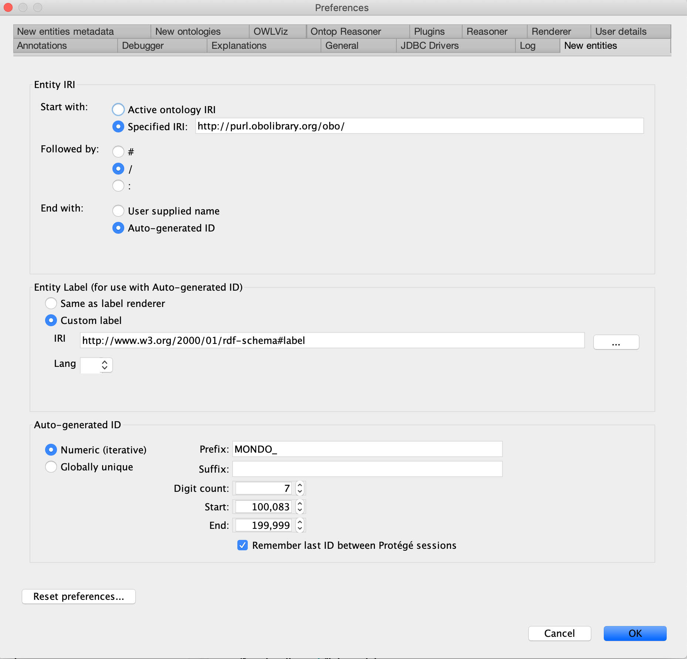
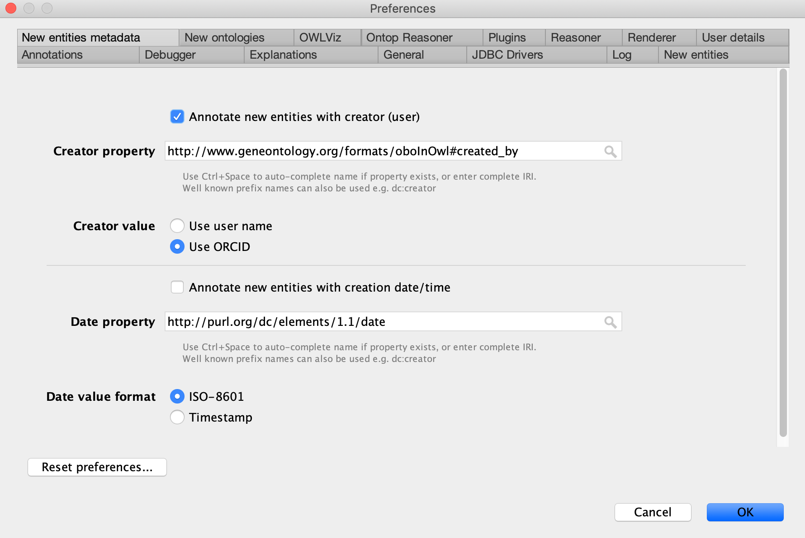

# Protege 5.5 setup for Mondo Editors

(This was adopted from the [Gene Ontology editors guide](http://wiki.geneontology.org/index.php/Protege5_5_setup_for_GO_Eds))

## Operating System
These instructions are for Mac OS

## Protege version
As of August 2019, Mondo editors are using `Protege version 5.5.0`

## Download and install Protege
- Get Protege from [protege.stanford.edu](https://protege.stanford.edu/)
- Unzip and move the Protege app to your Applications folder.
- See [Install_Protege5_Mac](https://protegewiki.stanford.edu/wiki/Install_Protege5_Mac) for more instructions and troubleshooting common problems.

## Increase memory in Protege

1. Protege needs at least 4G of RAM to cope with Mondo, ideally use 12G or 16G if your machine can handle it.
1. If running from Protege.app on a mac, open the /Applications/Protege-5.5.0/Protégé.app/Contents/info.plist file
1. Below the line: <string>-Xss16M</string>
1. Insert another line: <string>-Xmx12G</string>
1. Note - if you have issues opening Protege, then reduce the memory, try 10G (or lower) instead.

## Add ELK reasoner
These instructions are written for Mac users.

#### Install **ELK 0.5**
- - Click here to get the latest [Protege Plugin latest build](https://oss.sonatype.org/service/local/artifact/maven/content?r=snapshots&g=org.semanticweb.elk&a=elk-distribution-protege&e=zip&v=LATEST) (this is available on the bottom of [ELK pages](https://github.com/liveontologies/elk-reasoner/wiki/GettingElk). This will download a zipped file.)

  - When downloaded, unzip and copy puli and elk jars (two .jar files) in the unpacked directory.
  -  Paste these files in your Protege plugin directory, as described below. This can be done via one of two ways:

#### Approach 1

  1. In Terminal:
      `open ~/.Protege, then click on plugins`
  2. Click on plugins
  3. Copy and paste the two files into the plugins directory
  4. Restart Protege. You should see ELK 0.5 installed in your Reasoner menu.

 #### Approach 2
   1. Paste these files in your Protege plugin directory. This is in one of two locations:
       - ~/.Protege/plugins (note this is usually hidden from finder, but you can see it in the terminal) or
       - Go to Protege in Applications (Finder), right click, 'Show package contents' -> Java -> plugins
   1. Copy and paste the two files into the plugins directory
   1. Restart Protege. You should see ELK 0.5 installed in your Reasoner menu.
   
Important: it seems Elk 0.5 does not work with all versions of Protege, in particular, 5.2 and below. These instructions were only tested with Protege 5.5.

#### Video explanation

<iframe width="560" height="315" src="https://www.youtube.com/embed/5-UYTmly59I" title="YouTube video player" frameborder="0" allow="accelerometer; autoplay; clipboard-write; encrypted-media; gyroscope; picture-in-picture" allowfullscreen></iframe> 

 ### Remove the old Elk Reasoner
 It may be necessary to remove the old Elk reasoner.

 1. in your terminal, type:
open ~/.Protege/
 2. go to plugins
 3. delete: org.semanticweb.elk.jar
 4. Restart Protege

## Fix memory settings
- Protege needs at least 4G of RAM to cope with Mondo, ideally use 12G or 16G if your machine can handle it.
- If running from Protege.app on a mac, open the /Applications/Protege-5.5.0/Protégé.app/Contents/info.plist file
  - Below the line: `<string>-Xss16M</string>`
  - Insert another line: `<string>-Xmx12G</string>`

_Note - if you have issues opening Protege, then reduce the memory, try 10G (or lower) instead._

## Instructions for new Protege users

### Obtaining your ID range
- Curators and projects are assigned specific Mondo term ID ranges by senior editors.
- These ID ranges are stored in the file: [mondo-idranges.owl](https://github.com/monarch-initiative/mondo/blob/master/src/ontology/mondo-idranges.owl)
- **NOTE:** You should only use IDs within your range.

### Setting ID range
- Once you have your assigned ID range, you need to configure Protege so that your ID range is recorded in the Preferences menu. Protege does not read the mondo-idranges.owl file.
- In the Protege menu, select Preferences.
In the resulting pop-up window, click on the `New Entities` tab and set the values as described below.
1. In the `Entity IRI` section:
  - `Start with`: Specified IRI: http://purl.obolibrary.org/obo
  - `Followed by` /
  - `End with`: Select `Auto-generated ID`
2. In the Entity Label section:
  - Select `Custom label`
  - `IRI` http://www.w3.org/2000/01/rdf-schema#label
3. In the Auto-generated ID section:
  - Select `Numeric (iterative)`
  - Prefix: "MONDO_"
  - Suffix: leave this blank
  - Digit Count: "7"
  - Start and End: see [mondo-idranges.owl](https://github.com/monarch-initiative/mondo/blob/master/src/ontology/mondo-idranges.owl). Only paste the number after the MONDO: prefix. Also, note that when you paste in your MONDO ID range, the number will automatically be converted to a standard number, e.g. pasting 0110001 will be converted to 110,001.)
4. Check the `Remember last ID between Protege sessions` box (Note: You want the ID to be remembered to prevent clashes when working in parallel on branches.)

### Switching ID range

If you edit another ontology besides Mondo, you will need to switch your ID range. Protege (unfortunately) does not remember the last prefix or ID range that you used when you switch between ontologies. Therefore we need to manually update this each time we switch ontologies. See [instructions here](https://oboacademy.github.io/obook/howto/switching-ontologies/).

## User details

1. `User name` Clcik `Use supplied user name:` add your name (ie nicolevasilevsky)
2. Check `Use Git user name when available`
3. Add `ORCID`. Add the ID number only, do not include https://, ie 0000-0001-5208-3432

## Setting username and auto-adding creation date

1. In the Protege menu, go to `Preferences` > `New Entities Metadata` tab
1. Check `Annotate new entities with creator (user)` box
1. In the `Creator property` field, search for `creator` (type in `creator` then click the search button)
1. Select `dcterms:contributor` from the list
1. Manually edit the property to dcterms:creator
1. `Creator value` Select Use ORCID
1. `Date property` http://purl.org/dc/elements/1.1/date
1. `Date value format` Select ISO-8601

