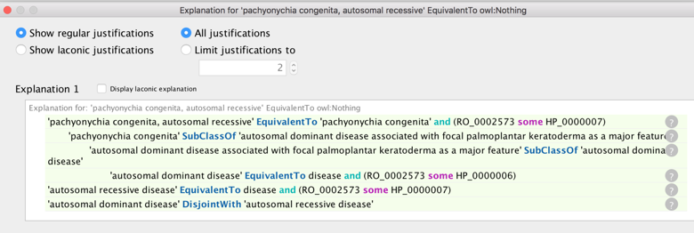

# Design Patterns

## Design Pattern (DP) Docs

The canonical design pattern documentation is in [https://github.com/monarch-initiative/mondo-build/tree/master/src/patterns](https://github.com/monarch-initiative/mondo-build/tree/master/src/patterns)

For now you have to browse the YAML files and understand the underlying principles of DOSDP. Some DPs are not yet fully documented, this is ongoing.

## Modes of inheritance

For background see: [https://github.com/monarch-initiative/monarch-disease-ontology/issues/406](https://github.com/monarch-initiative/monarch-disease-ontology/issues/406)

* [https://github.com/monarch-initiative/mondo-build/blob/master/src/patterns/autosomal_dominant.yaml](https://github.com/monarch-initiative/mondo-build/blob/master/src/patterns/autosomal_dominant.yaml)

* [https://github.com/monarch-initiative/mondo-build/blob/master/src/patterns/autosomal_recessive.yaml](https://github.com/monarch-initiative/mondo-build/blob/master/src/patterns/autosomal_recessive.yaml)

* [https://github.com/monarch-initiative/mondo-build/blob/master/src/patterns/y_linked.yaml](https://github.com/monarch-initiative/mondo-build/blob/master/src/patterns/y_linked.yaml)

* [https://github.com/monarch-initiative/mondo-build/blob/master/src/patterns/x_linked.yaml](https://github.com/monarch-initiative/mondo-build/blob/master/src/patterns/x_linked.yaml)
 
These are axiomatized using HPO classes (AD, AR, X-linked, ..). Note that care must be taken here. E.g. some diseases are named deceptively. E.g. We have SCA types, 1, 2, 3 etc, and also classes ‘AR SCA 1, …’. It may seem that the ones named SCA are inheritance-neutral but in fact these are AD. Thus an axiomatization (SCAR1 = SCA1 and AR) would be wrong (and the reasoner will detect this).
 
Note there are many cases where ORDO classifies simultaneously as **both** AD and AR (or inherited and not-inherited). The reasoner will detect this if we mirror these axioms. All these are placed in the ordo_inheritance_inconsistent subset [update: do we still do this?]. In most cases these were manually resolved by treating the Ordo class as more generic.
 
Disjointness axioms are added such that no disease has > 1 mode of inheritance states in an all-some axiom.
 
### Case Study: Thalassemia
 
The DO adopts a standard classification of this disease, placing it as AR:


 
However, note that DO includes an X-linked syndrome that has alpha-thalassemia as a feature as a subclass. The reasoner detects this mistake.
We avoid this as we adopt the ORDO classification where we have a separate bucket for diseases with AT as a feature.
 
### Case Study: Aarskog
 
Aarskog is typically classified as X-linked, but there are AD forms, leading to some confusion over names. DO places this as AD:


 
This is not correct.
 
To avoid naming confusion we call the X-linked form ‘Aarskog syndrome, X-linked’ and the disease corresponding to the DO class above as ‘Aarskog syndrome, AD’. We place both under a new grouping class ‘Aarskog-like’
S
### peculative diseases and N=1s

For a full discussion see [https://github.com/monarch-initiative/monarch-disease-ontology/issues/400](https://github.com/monarch-initiative/monarch-disease-ontology/issues/400)

* Place speculative into ‘speculative’ subset
* (Optional) add a disease_shares_features_of link to the prototype

### Case study: pachyonychia congenita
 
pachyonychia congenita, autosomal recessive (OMIM:260130) was found by the reasoner to be inconsistent:



On examination it was apparent that the AR form was speculative. This may be slated for obsoletion, but for now we placed to speculative subset, classified it using its grandparent terms and added a disease_shares_features_of relationship to (AD) pachyonychia congenita.

### Isolated vs syndromic diseases
 
We use two different modifiers to indicate syndromic vs isolated

* [https://github.com/monarch-initiative/mondo-build/blob/master/src/patterns/syndromic.yaml](https://github.com/monarch-initiative/mondo-build/blob/master/src/patterns/syndromic.yaml)
* [https://github.com/monarch-initiative/mondo-build/blob/master/src/patterns/isolated.yaml](https://github.com/monarch-initiative/mondo-build/blob/master/src/patterns/isolated.yaml)

These are disjoint [implemented as a GCI in the axioms.owl file]. This means that they cannot be conflated via SubClassOf
 
### Diseases with diseases or phenotypes as major features
 
We use ‘disease has major feature’ to connect a disease D to a feature F, where F is either a diseases or phenotype. In these cases, we may desire not to see D classified under F.
 
This implicit DP is common in Orphanet.

For example: MONDO_0020286 'aortic malformation'

Equivalent To:  
`'disease or disorder' and ('disease has major feature' some 'Abnormal aortic morphology')`

Note: Abnormal aortic morphology comes from HPO (HP_0001679)
 
### Brachydactyly and Polydactyly
 
Of particular interest, in Orphanet both of these classes are classified as non-syndromic.

```
id: Orphanet:2913
name: Polydactyly
is_a: Orphanet:377794  ! group of disorders
relationship: part_of Orphanet:93458  ! Non-syndromic polydactyly, syndactyly and/or hyperphalangy
```

Same for brachydactly, syndactyly, …
 
This leads to inconsistencies if we declare non-syndromic and syndrome to be disjoint and we also try and classify syndromes with syndactylys as subclasses of ‘syndactyly’ for example:
 
Orphanet instead has grouping classes like ‘syndrome with X as major feature’. We adopt this pattern and axiomatize.

## Design patterns for neoplasms

We include one yaml file for each genus class (neoplasm, benign tumor, cancer, carcinoma, …) at the moment rather than over-genericizing.

Benign and cancer are disjoint. Note that DO frequently conflates these.
